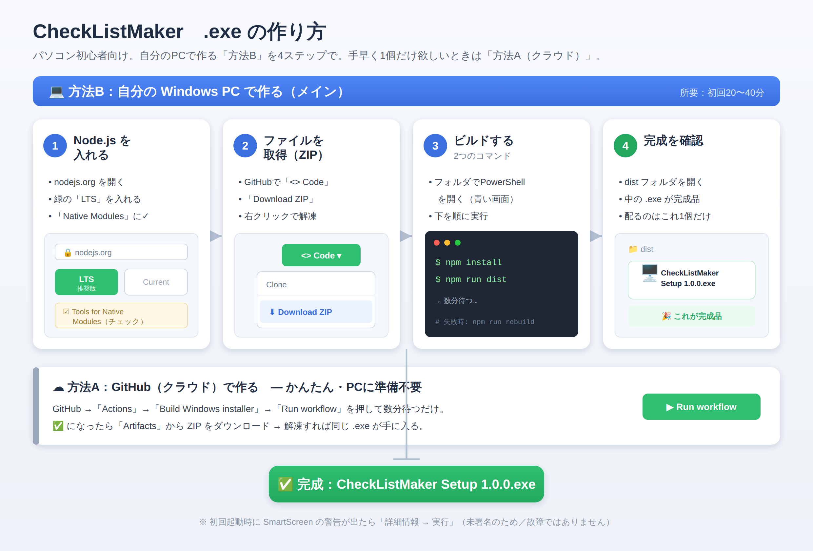

# CheckListMaker `.exe`（インストーラ）作成ガイド

CheckListMaker の **Windows 用インストーラ（`.exe`）を作る側**のための手順書です。
**パソコンの操作にあまり慣れていない方でも、上から順にそのまま進めれば `.exe` が作れる**
ように、1ステップずつ具体的に書いています。

できあがった `.exe` を**配る・使う**側の手順は
[使い始めガイド（Windows）](インストールと使い方ガイド.md) を見てください。

> 📌 この手順書で作る最終ファイルは
> **`CheckListMaker Setup 1.0.0.exe`**（ダブルクリックでインストールできる形）です。



---

## まずはどっちで作る？（2つの方法）

`.exe` を作る方法は 2 つあります。**どちらか片方だけ**やれば `.exe` ができます。

| | 方法A：クラウドで作る | **方法B：自分のPCで作る（メイン）** |
|---|---|---|
| 作業する場所 | GitHub のサイト上（ブラウザ） | 自分の **Windows** パソコン |
| 必要なもの | GitHub アカウント | Windows + Node.js（無料・後述） |
| 難しさ | 簡単（ボタンを押して待つだけ） | 少し手順は多いが、書いてある通りでOK |
| こんな人向け | とにかく1個 `.exe` が欲しい | 自分で何度も作り直したい／中身を直したい |

> 💡 まず試すなら **方法A** が一番ラクです。手元のパソコンで作り込みたいなら **方法B**。
> 以下はどちらも、初心者向けに細かく書いています。

---

# 方法B：自分の Windows パソコンで作る（くわしい手順）

> ⚠ **前提：Windows パソコンで作業してください。** CheckListMaker は録画機能のために
> Windows 専用の部品を含むため、**Windows の `.exe` は Windows 上で作る**のが確実です。
> （Mac で Windows 用は基本作れません。Mac/Linux 版は最後の「補足」を参照）

作業は大きく **4ステップ**です。

1. **準備①** Node.js（ノードジェイエス）を入れる
2. **準備②** CheckListMaker のファイル一式を手元にダウンロードする
3. **ビルド** コマンドを2つ実行して `.exe` を作る
4. **確認** できあがった `.exe` を見つける

所要時間の目安：初回は **20〜40分**ほど（ダウンロード待ちを含む）。2回目以降は数分です。

---

## 準備① Node.js を入れる

Node.js は、`.exe` を組み立てるために必要な無料のツールです。一度入れれば、次回からは
この準備は不要です。

### 手順

1. ブラウザで **公式サイト** を開く → <https://nodejs.org/>
2. 緑色のボタンが2つ並んでいます。**左側の「LTS」**（推奨版・安定版）のボタンを
   クリックして、インストーラ（`node-v○○-x64.msi` のようなファイル）をダウンロード。
   - ※ もう片方の「Current」ではなく、必ず **LTS** を選びます。
3. ダウンロードした `.msi` ファイルを**ダブルクリック**して、インストーラを起動。
4. 画面が出たら、基本は **「Next（次へ）」を押していくだけ**でOKです。
   - ライセンス同意のチェックを入れて Next。
   - インストール先などはそのまま（変更不要）。
5. 途中で **「Tools for Native Modules」**（ネイティブモジュール用のツール）という画面が
   出たら、**「Automatically install the necessary tools…」のチェックを入れて** Next を
   押してください。
   - ✅ これにチェックを入れておくと、後でビルドが失敗しにくくなります（C++ ビルドツールや
     Python を自動で入れてくれる）。**初心者の方はぜひチェックを入れてください。**
6. 最後に **「Install」** を押す（「このアプリがデバイスに変更を…」と聞かれたら「はい」）。
7. 完了したら **「Finish」**。
   - 5 でチェックを入れた場合、追加ツールのインストール用に黒い画面が開いて自動で進みます。
     **何かキーを押すよう促されたら押し、終わるまで（数分〜十数分）待って**ください。
     ウィンドウが閉じれば完了です。

### 入ったか確認する（任意だけど推奨）

1. キーボードの **Windows キー** を押し、**`PowerShell`** と入力して
   **「Windows PowerShell」** を開く（青い画面）。
2. 次の2行を1行ずつ入力し、各行で **Enter**：

   ```powershell
   node -v
   npm -v
   ```

3. それぞれ `v20.18.0`、`10.8.2` のように**バージョン番号が表示されれば成功**です。
   - もし「`node` は…認識されていません」と出る場合は、Node.js のインストールが
     未完了か、一度パソコンを**再起動**してから再度試してください。

---

## 準備② CheckListMaker のファイル一式をダウンロードする

ビルドするには、CheckListMaker のソースファイルを手元に置く必要があります。
**初心者の方は、下の「ZIP でダウンロード」が一番カンタン**です。

### いちばん簡単な方法：ZIP でダウンロード

1. ブラウザで CheckListMaker のリポジトリ（GitHub のページ）を開く。
2. 緑色の **「<> Code」** ボタンを押す。
3. 出てきたメニューの一番下 **「Download ZIP」** をクリック。
4. ダウンロードした ZIP ファイル（例：`CheckListMaker-main.zip`）を見つける。
   - 通常は **「ダウンロード」フォルダ**に入ります。
5. ZIP を**右クリック → 「すべて展開」**（解凍）。展開先はわかりやすい場所
   （例：**デスクトップ**）を選ぶと後がラクです。
6. 展開してできたフォルダ（例：`CheckListMaker-main`）を開くと、中に
   **`package.json`** や **`main.js`** などのファイルが見えます。
   ここが作業フォルダです。

> 💡  ZIP を解凍すると、フォルダの中にもう1段同じ名前のフォルダがある場合があります。
> **`package.json` が直接見えるフォルダ**が正しい作業場所です。

### （上級者向け）git を使う場合

Git for Windows を入れている方は、PowerShell で次でも取得できます：

```powershell
git clone https://github.com/kuwagata-137/CheckListMaker.git
cd CheckListMaker
```

---

## ビルド：`.exe` を作る

ここが本番です。**「作業フォルダの中で」コマンドを実行する**のがポイントです。

### ステップ1：作業フォルダで PowerShell を開く

1. 準備②で展開した、**`package.json` が見えるフォルダ**をエクスプローラーで開く。
2. フォルダ上部の **アドレスバー**（フォルダの場所が書いてある細長い欄）を**クリック**して、
   中の文字を消し、**`powershell`** と入力して **Enter**。
   - → そのフォルダの場所で PowerShell（青い画面）が開きます。これで準備OK。
   - うまくいかない場合：フォルダ内の何もないところで **Shift を押しながら右クリック**
     → **「PowerShell ウィンドウをここで開く」** でも同じです。

> ✅ **確認**：青い画面の左端に、さっきのフォルダのパス（例：
> `C:\Users\あなた\Desktop\CheckListMaker-main>`）が表示されていればOKです。
> ここが違うフォルダだと、後のコマンドが失敗します。

### ステップ2：必要な部品をそろえる（`npm install`）

PowerShell に次を入力して **Enter**：

```powershell
npm install
```

- インターネットから部品をダウンロードします。**数分かかることがあります**
  （文字がたくさん流れます。これは正常です）。
- 「`added ○○ packages`」のような表示が出て、再び入力待ち（カーソルが点滅）に
  戻れば完了です。
- ⚠ 黄色い **警告（warning）** はたくさん出ますが、**無視してOK**です。
  止まるのは赤い **エラー（error）** が出たときだけ（→ 後述の「困ったとき」へ）。

### ステップ3：`.exe` を組み立てる（`npm run dist`）

続けて次を入力して **Enter**：

```powershell
npm run dist
```

- ここで初めて、配布用のインストーラ（`.exe`）が作られます。
- 「`electron-builder`」という文字とともに進み、**数分**かかります。
- 「`building        target=nsis`」や「`building block map`」のような行のあと、
  エラーなく入力待ちに戻れば**成功**です。

---

## 確認：できあがった `.exe` を見つける

1. 作業フォルダ（`package.json` があるフォルダ）の中に、新しく **`dist`** という
   フォルダができています。
2. その `dist` フォルダを開くと、**`CheckListMaker Setup 1.0.0.exe`** が入っています。
   **これが完成品**です 🎉
   - 同じフォルダに `.blockmap` や `win-unpacked` など他のファイル・フォルダも
     できますが、配るのは **`CheckListMaker Setup 1.0.0.exe` だけ**でOKです。
3. この `.exe` を使う／配る方法は
   [使い始めガイド（Windows）](インストールと使い方ガイド.md) を参照してください。

> 📝 アプリのバージョン（ファイル名の `1.0.0` の部分）を変えたいときは、`package.json`
> の中の `"version": "1.0.0"` を書き換えてから、もう一度
> 「ステップ3：`npm run dist`」を実行します。

---

# 方法A：GitHub（クラウド）で作る（くわしい手順）

パソコンに Node.js を入れたくない／とりあえず1個欲しい、というときはこちら。
**GitHub のサーバーが代わりに `.exe` を組み立ててくれます。** パソコン側の準備は不要です。

### 手順

1. ブラウザで **GitHub にログイン**し、CheckListMaker のリポジトリのページを開く。
2. ページ上部のタブの中から **「Actions」** をクリック。
3. 左側のリスト（Workflows）から **「Build Windows installer」** をクリック。
4. 右側に表示される **「Run workflow ▾」** ボタンをクリック。
   - 小さなパネルが開くので、ブランチはそのまま（または対象ブランチを選択）で、
     緑色の **「Run workflow」** ボタンを押します。
5. 1〜2秒で一覧の一番上に**新しい実行**が現れます（黄色い ● は「実行中」）。
   - **数分**待ち、ときどきページを更新（再読み込み）します。
   - **緑のチェック ✅** に変われば成功です（赤い × は失敗 → 「困ったとき」へ）。
6. その実行（緑チェックの行）を**クリック**して実行ページを開く。
7. ページを**一番下までスクロール**し、**「Artifacts」** の欄にある
   **`CheckListMaker-Windows-installer`** をクリック → **ZIP がダウンロード**されます。
8. ZIP を解凍すると、中に **`CheckListMaker Setup 1.0.0.exe`** が入っています。完成です。

> 📝 各実行ページの上部 **「Summary」** にも、その回のダウンロードリンクが自動表示されます。
>
> ⚠ ダウンロードできる成果物（Artifact）は **約90日で消えます**。消えていたら、上の
> 手順で **もう一度 Run workflow** すれば、新しい `.exe` が作り直されます。

### この方法のしくみ（参考）

ビルドの中身は `.github/workflows/build-windows.yml` に書かれています。GitHub が
Windows マシンを用意し、方法B と同じ `npm install` → `npm run dist` を自動実行して
`.exe` を作っています。

---

## できあがるもの（共通）

どちらの方法でも、できる `.exe` は同じ仕様です。

- ファイル名：**`CheckListMaker Setup <バージョン>.exe`**（例：`... 1.0.0.exe`）。
- 種類：**ワンクリックのインストーラ**。実行するとインストールされ、デスクトップと
  スタートメニューにショートカットが作られます。
- 権限：**管理者不要**（現在のユーザー向けにインストールされます）。
- 導入先：`%LOCALAPPDATA%\Programs\CheckListMaker\`。

---

## 困ったとき（トラブル対処）

### 共通

- **作った `.exe` を実行すると「Windows によって PC が保護されました」と出る**
  → このアプリは**コード署名をしていない**ための警告で、故障ではありません。
  **「詳細情報」→「実行」** で起動できます（配布相手にもこの操作を伝えてください）。
- **ウイルス対策ソフトが反応する** → 署名なしの新しい `.exe` でよく起きる誤検知です。
  必要なら除外設定に追加してください。

### 方法B（自分のPC）でエラーが出たとき

- **PowerShell で `npm` が「スクリプトの実行が無効になっている」等で止まる**
  → セキュリティ設定が原因です。次のどちらかで回避：
  1. PowerShell の代わりに **「コマンド プロンプト（cmd）」** を使う
     （Windows キー → `cmd` → 同じフォルダで開いて、同じ `npm install` / `npm run dist`）。
  2. もしくは PowerShell で次を1回実行してから、やり直す：
     ```powershell
     Set-ExecutionPolicy -Scope CurrentUser RemoteSigned
     ```
     （「実行しますか？」には `Y` を入力）
- **`npm install` や `npm run dist` が赤いエラー（node-gyp / build error 等）で止まる**
  → ビルド用ツールが足りない可能性。順に試してください：
  1. まず次を実行してから、もう一度 `npm run dist`：
     ```powershell
     npm run rebuild
     ```
  2. それでもダメなら、**準備①で Node.js を入れ直し**、今度は
     **「Tools for Native Modules」のチェックを必ず入れて**インストールする。
  3. または、**Visual Studio Build Tools**（C++ のワークロード）と **Python** を
     手動で入れる。
  - ※ ここで詰まったら、準備不要の **方法A（クラウド）** に切り替えるのが手っ取り早いです。
- **コマンドが「そんなファイルはない」と言う／`dist` が作られない**
  → PowerShell が**別のフォルダ**で動いている可能性大。「ビルド：ステップ1」をやり直し、
  左端のパスが `package.json` のあるフォルダになっているか確認してください。

### 方法A（クラウド）でエラーが出たとき

- **「Actions」に「Build Windows installer」が見当たらない**
  → リポジトリの `.github/workflows/` にワークフローがあるか確認してください。
  この機能を含むブランチがまだ取り込まれていない場合は表示されないことがあります。
- **実行が赤い × で失敗する** → 失敗した実行を開き、赤い印のステップをクリックすると
  ログ（原因）が読めます。一時的な失敗のこともあるので、まず **Run workflow で再実行**
  を試してください。

---

## 補足：アイコン・署名・他OS（任意）

- **独自アイコンを付けたい** → `build/icon.ico`（256×256 以上）を置いてから作ると
  自動で採用されます。置かない場合は既定の Electron アイコンになります。
- **SmartScreen の警告を消したい** → 有料の**コード署名証明書**が必要です。証明書を用意し、
  `package.json` の `build` 設定に署名情報を足します（任意。なくても動作はします）。
- **Mac / Linux 版が欲しい** → その OS 上で
  `npx electron-builder --mac` / `npx electron-builder --linux` を実行します
  （`package.json` の `build` 設定はそのまま流用できます）。

---

## まとめ（最短ルート）

**方法B（自分のPC・メイン）**

```
① Node.js を入れる（LTS／ネイティブツールのチェックを入れる）
② ファイル一式を ZIP でダウンロードして解凍
③ そのフォルダで PowerShell を開き、npm install → npm run dist
④ dist フォルダの CheckListMaker Setup 1.0.0.exe が完成品
```

**方法A（クラウド・準備不要）**

```
GitHub →「Actions」→「Build Windows installer」→「Run workflow」
→ ✅ になったら Artifacts から ZIP を取得 → 解凍 → .exe 完成
```
